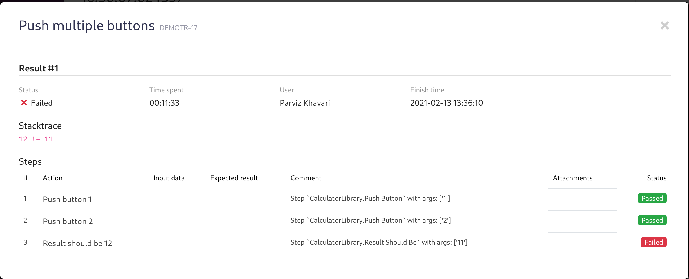

# [Qase TMS](https://qase.io) Robot Framework Listener

[](https://www.apache.org/licenses/LICENSE-2.0)

## Installation

```
pip install qase-robotframework
```

## Usage

You must add Qase case IDs to robot framework tests.
They should be added as a tags in form like `Q-<case id without project code>`. Examples:

```robotframework
*** Test Cases ***
Push button
    [Tags]  Q-2
    Push button    1
    Result should be    1

Push multiple buttons
    [Tags]  Q-3
    Push button    1
    Push button    2
    Result should be    12
```

```robotframework

*** Test Cases ***    Expression    Expected
Addition              12 + 2 + 2    16
                      2 + -3        -1
    [Tags]   Q-7

Subtraction           12 - 2 - 2    8
                      2 - -3        5
    [Tags]   Q-8
```

After adding new tags and configuring listener - you could simply use it like this:

```
robot --listener qaseio.robotframework.Listener keyword_driven.robot data_driven.robot
```

## Configuration

Listener supports loading configuration both from environment variables and from `tox.ini` file.

ENV variables:
- `QASE_API_TOKEN` - API token to access Qase TMS
- `QASE_PROJECT` - Project code from Qase TMS
- `QASE_RUN_ID` - Run ID if you want to add results to existing run
- `QASE_RUN_NAME` - Set custom run name when no run ID is provided
- `QASE_DEBUG` - If passed something - will enable debug logging for listener

`tox.ini` configuration:

```ini
[qase]
qase_api_token=<API TOKEN>
qase_project=PROJECTCODE
qase_run_id=14
qase_run_name=New Robot Framework Run
qase_debug=True
```

## Working with steps

Listener supports reporting steps results:

But in order to use it, you should follow some rules:
- Steps name in Qase TMS should match to the steps in Robot Framework
- If step in RF has some parameters (e.g. Push Button `12`)
parameter would be ignored and the comparison to step in TMS will be made like:
step in TMS should start with step name in RF. So if your step in RF is
`Open page` it will be matched to step `Open page https://qase.io` in TMS.
- You should preserve the order of steps. You can skip steps in RF, but
you shouldn't mix them or so on - Qase does not support creating steps
on the fly yet.

## Contribution

Install project locally:

```bash
python3 -m venv .venv
source .venv/bin/activate
pip install -e .[testing]
```

Install dev requirements:

```bash
pip install pre-commit
pre-commit install
```

Test project:

```bash
tox
```
