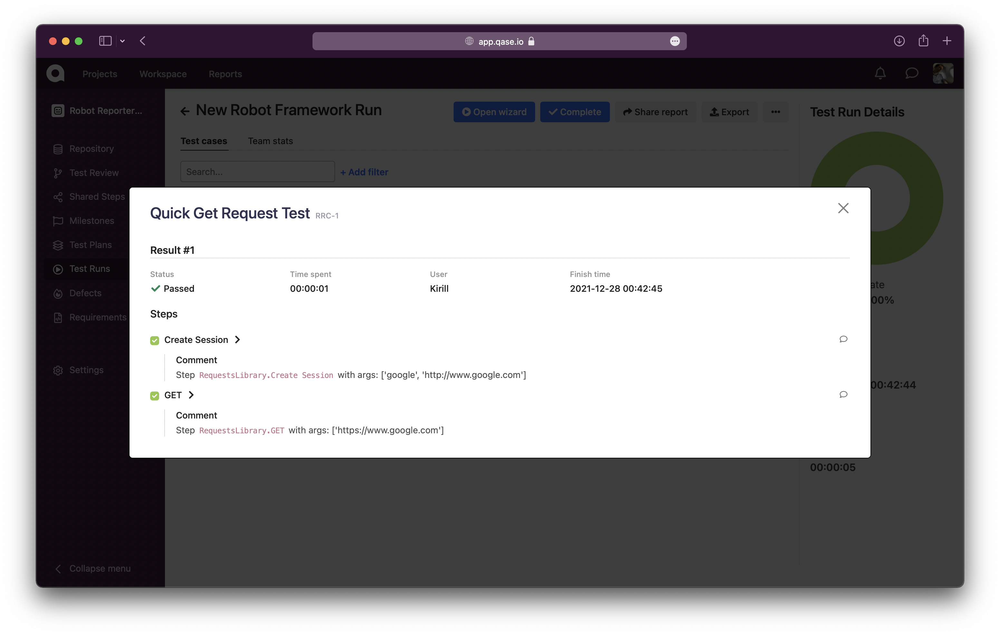
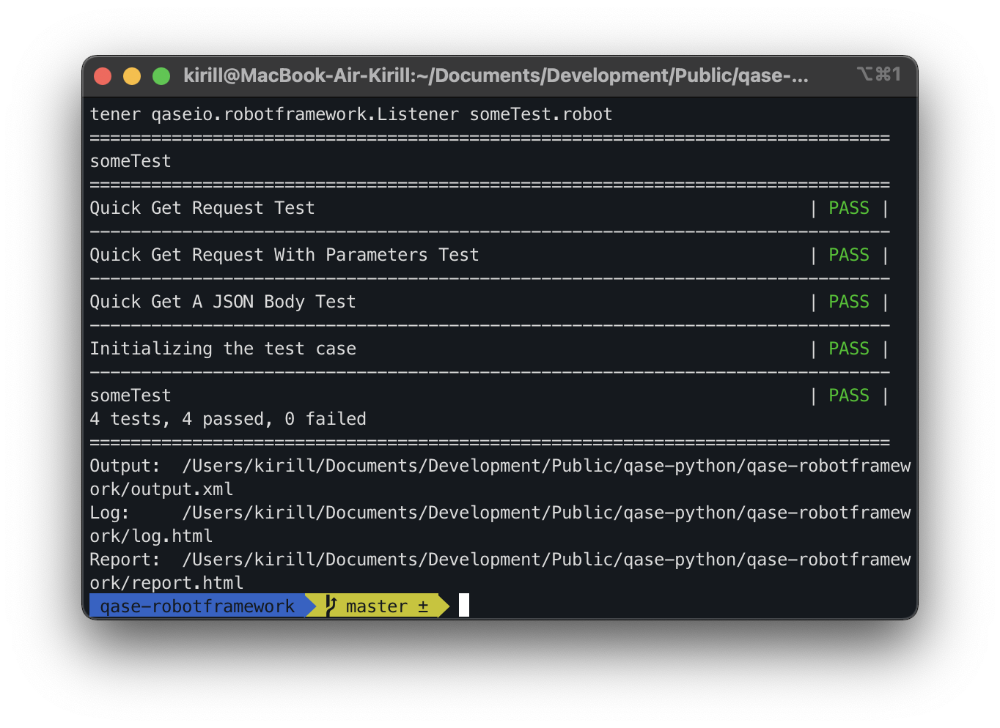

> # Qase TMS Robot Framework Listener
>
> Publish results simple and easy.

## How to integrate

```
pip install qase-robotframework
```

## Usage

You must add Qase case IDs to robot framework tests.
They should be added as a tags in form like `Q-<case id without project code>`. You can use upper and lower case to indicate the test case IDs. Example:

```robotframework
*** Test Cases ***
Push button
    [Tags]  q-2
    Push button    1
    Result should be    1

Push multiple buttons
    [Tags]  Q-3
    Push button    1
    Push button    2
    Result should be    12
```

```robotframework
*** Test Cases ***    Expression    Expected
Addition              12 + 2 + 2    16
                      2 + -3        -1
    [Tags]   Q-7

Subtraction           12 - 2 - 2    8
                      2 - -3        5
    [Tags]   Q-8
```

### Working with steps

Listener supports reporting steps results:

But in order to use it, you should follow some rules:
- Steps name in Qase TMS should match to the steps in Robot Framework
- If step in RF has some parameters (e.g. Push Button `12`)
parameter would be ignored and the comparison to step in TMS will be made like:
step in TMS should start with step name in RF. So if your step in RF is
`Open page` it will be matched to step `Open page https://qase.io` in TMS.
- You should preserve the order of steps. You can skip steps in RF, but
you shouldn't mix them or so on - Qase does not support creating steps
on the fly yet.

Example:
```robotframework
Quick Get A JSON Body Test                                                  ## Test case: "Quick Get A JSON Body Test"
    [Tags]  Q-3
    ${response}=    GET  https://jsonplaceholder.typicode.com/posts/1       ## 1-st step - "GET"
    Should Be Equal As Strings    1  ${response.json()}[id]                 ## 2-nd step - "Should Be Equal As Strings"

Initializing the test case                                                  ## Test case: "Initializing the test case"
    [Tags]  q-4
    Set To Dictionary    ${info}   field1=A sample string                   ## 1-st step - "Set To Dictionary"
```

## Configuration

Listener supports loading configuration both from environment variables and from `tox.ini` file.

ENV variables:
- `QASE_API_TOKEN` - API token to access Qase TMS
- `QASE_PROJECT` - Project code from Qase TMS
- `QASE_RUN_ID` - Run ID if you want to add results to existing run
- `QASE_RUN_NAME` - Set custom run name when no run ID is provided
- `QASE_DEBUG` - If passed something - will enable debug logging for listener

### Usage:
```
QASE_API_TOKEN=<API TOKEN> QASE_PROJECT=PRJCODE robot --listener qaseio.robotframework.Listener keyword_driven.robot data_driven.robot
```

Moving variables to `tox.ini`, example configuration:
```ini
[qase]
qase_api_token=api_key
qase_project=project_code
qase_run_id=run_id
qase_run_name=New Robot Framework Run
qase_debug=True
```
Execution:
```
robot --listener qaseio.robotframework.Listener someTest.robot
```
## Contribution

Install project locally:

```bash
python3 -m venv .venv
source .venv/bin/activate
pip install -e .[testing]
```

Install dev requirements:

```bash
pip install pre-commit
pre-commit install
```

Test project:

```bash
tox
```
